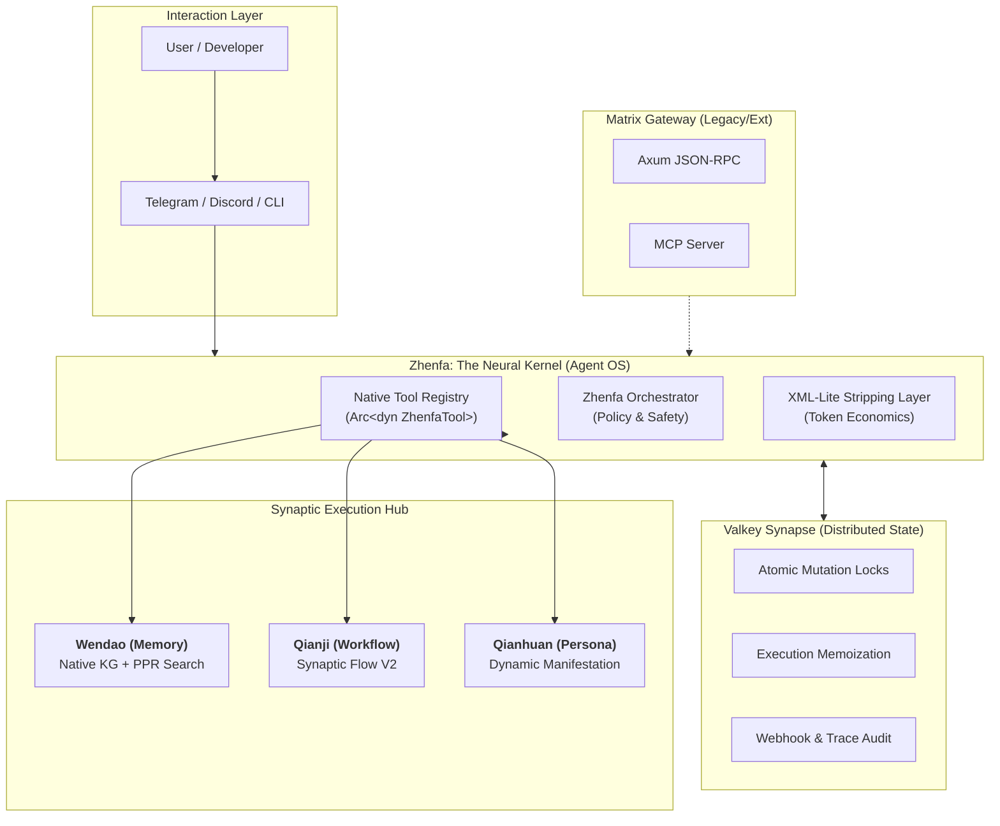

# CyberXiuXian Artisan Workshop (赛博修仙创意工坊)

(赛博修仙创意工坊)

**The Agentic OS Kernel. Native-First. Synaptic Flow. Valkey-Powered.**

CyberXiuXian Artisan Workshop (赛博修仙创意工坊) is more than an MCP agent;
it is a **High-Performance AI Operating System Kernel**
designed for the next generation of autonomous intelligent agents.
It bridges the gap between LLM reasoning and system-level execution via a **Zero-copy Native Memory Bus**, self-evolving **Synaptic Workflows**, and a distributed **Valkey Synapse** for real-time state orchestration.

---

## 🏛️ Architecture: The Neural Kernel (Trinity V2)

The system has evolved from a simple gateway into a **Microkernel & Native Plugins** architecture, heavily inspired by the internal performance optimizations of OpenAI's Codex and the human-centric design of OpenClaw.

---

## 💎 Why Omni-Dev Fusion V2?

| Feature         | The Legacy AI Way                  | **The Omni-Fusion Way (V2)**                |
| :-------------- | :--------------------------------- | :------------------------------------------ |
| **Execution**   | External Microservices (HTTP/JSON) | **Native In-Process Calls (Rust Pointers)** |
| **Latency**     | 50ms - 500ms (Serialization Tax)   | **< 1ms (Zero-Copy Dispatch)**              |
| **Reasoning**   | Stateless prompt-response          | **Synaptic Flow V2 (Adversarial Loops)**    |
| **Interaction** | "Dumb" sequential queue            | **Human-Centric (Interrupt, HITL, Steer)**  |
| **Context**     | Bloated JSON Blobs                 | **Stripped XML-Lite (Attention Optimized)** |

---

## 🧠 Core Breakthroughs

### 1. Synaptic Flow V2: Adversarial Reasoning

We implement the **Unity of Knowledge and Action**.

- **The Scenario**: "Agenda Steward" proposes a plan; "Strict Teacher" critiques it.
- **Dynamic Control**: The Critic node can emit a `RetryNodes` instruction based on an LLM-generated `<score>`, forcing the Proposer to rewrite until it meets historical reality constraints stored in **Wendao**.

### 2. The Stripping Layer (JSON Stripping)

To solve "Formatting Hallucination," our native tools bypass JSON for content delivery. They return **XML-Lite** tags (`<hit>`, `<score>`) directly into the LLM's attention window, maximizing reasoning precision and minimizing token cost.

### 3. Distributed Synapse (Valkey)

Valkey acts as the system's spinal cord, providing:

- **Atomic Locking**: Prevents race conditions during multi-agent tool execution.
- **Caching**: Microsecond-level recall for repeated tool invocations.
- **Persistence**: Context survives server restarts with OpenClaw-style "Fake Restore" indexing.

---

## 🦀 The Rust Ecosystem (19+ Crates)

The kernel is built on a robust, high-performance Rust foundation:

- **`xiuxian-zhenfa`**: The Agent OS Kernel. Native registry and orchestrator.
- **`xiuxian-qianji`**: The Synaptic workflow engine. Supports LLM-driven flow control.
- **`xiuxian-wendao`**: High-performance Knowledge Graph & PPR Search engine.
- **`omni-memory`**: MemRL-inspired self-evolving episodic memory.
- **`xiuxian-macros`**: Proc-macros for zero-boilerplate tool integration (`#[zhenfa_tool]`).

---

## 🛠️ What you can do today

- **Native Tool Calling**: Implement a tool in 5 minutes using `#[zhenfa_tool]` and get microsecond performance.
- **Adversarial Validation**: Run complex "Draft-Critique-Revise" loops with `Qianji` manifests.
- **Human-Centric Interaction**: Interrupt a rambling agent, or require approval for destructive tools.
- **Zero-Trust Security**: Unified permission gatekeeping via `ZhenfaOrchestrator`.

---

**CyberXiuXian Artisan Workshop (赛博修仙创意工坊)** - _Building the Neural Backbone of the Future._
